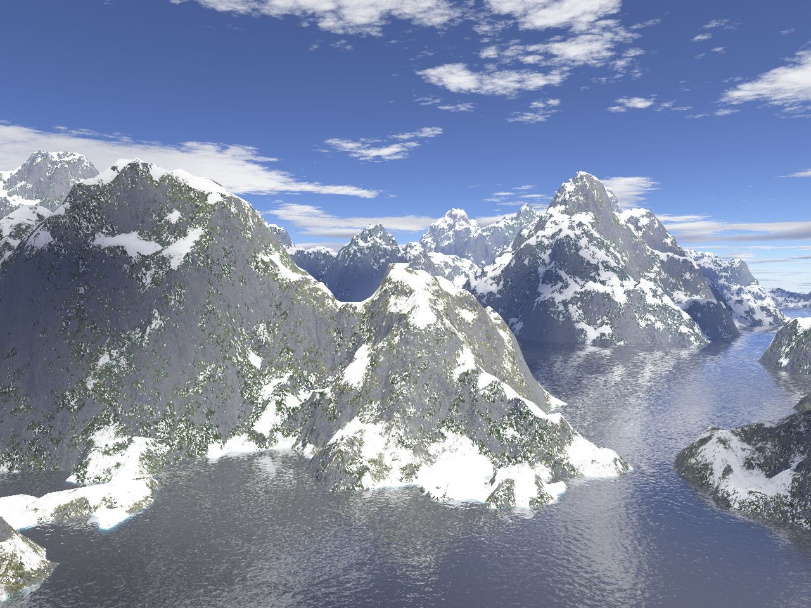
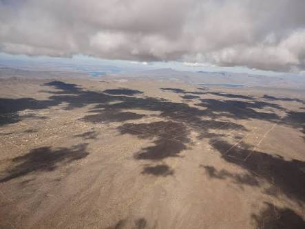
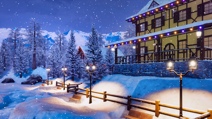

{width="600px"}

# Description

In this project, we want to generate a  mountainous landscape procedurally, using [Perlin Noise](https://en.wikipedia.org/wiki/Perlin_noise) to achieve this.

# Goals and Deliverables

Voir: https://lgg.epfl.ch/teaching/ICG2019/icg_lectures/2019_project_instructions/

## Minimal requirements

A movable camera (with arrow keys) that allows to move around the world that is generated procedurally and resembles a mountain-like landscape.
As a minimal requirement, no textures will be applied on the landscape but colours according to the altitude.

## Optional extensions

- Replace colours according to altitude with more realistic textures

- More complex lighting model (Phong)

- Water with reflections (or only specular component) on it

- Virtual clouds which create shadows on the ground; no volumetric clouds, simply a monoscale texture that blocks or lets light through.

 {width="300px"} 

- Multiple light sources: the sun high above and maybe some smaller and less intense light sources on the map itself.

 {width="300px"} 

## Expected results

We want to be able to freely move the camera around the world in order to explore it. We should be able to see the different biomes of the mountains and the different lighting effects (reflections, shadows, specular, etc) depending on which optional extensions we will be required to implement.
There should be a fixed rendering distance beyond which the world is not generated. When moving, the new parts of the world should be generated on the fly.

# Schedule

We would prefer to specify at the beginning of each week on what which team member will work. But we were thinking about the following general schedule:

## Week 1:
### Perlin noise function, mesh generation for the terrain and colors applied according to altitude
- Markus: Study & implement Perlin noise function
- Robin: Render moutain & limit rendering to a certain distance
- Charline: Colour mountains according to altitude

## Week 2:
### Create different biomes (water, ice, rock, etc) and map textures
- Markus: Find different textures and link them to the project to be able to load and use them
- Robin & Charline: Create different biomes

## Week 3:
### Add phong lighting model (ambient, diffuse, specular)
- Markus: Ambient
- Robin: Diffuse
- Charline: Specular

## Week 4:
### Add shadows created by clouds and/or multiple light sources
- Markus: Shadow
- Robin: Clouds
- Charline: Join Shadows or Clouds according to difficulty

# Resources

OpenGL

___
# Links [à supprimer avant de submit]
- [General guideline for map generation](https://www.redblobgames.com/maps/terrain-from-noise/)
- [Perlin Noise implementation c++](https://github.com/sol-prog/Perlin_Noise)
