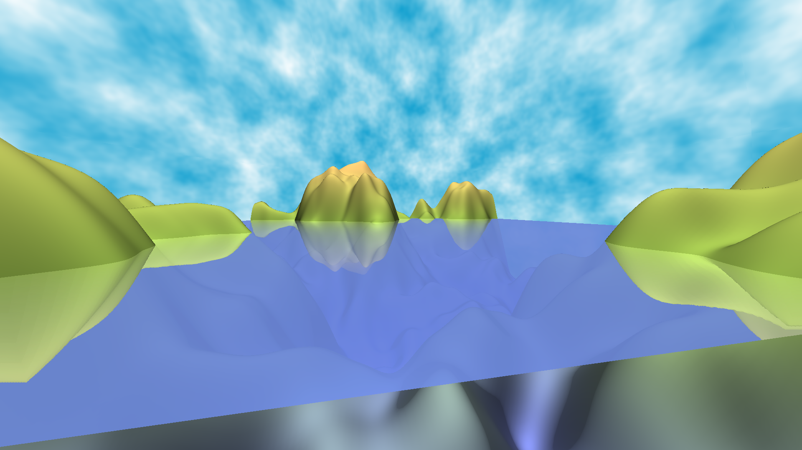
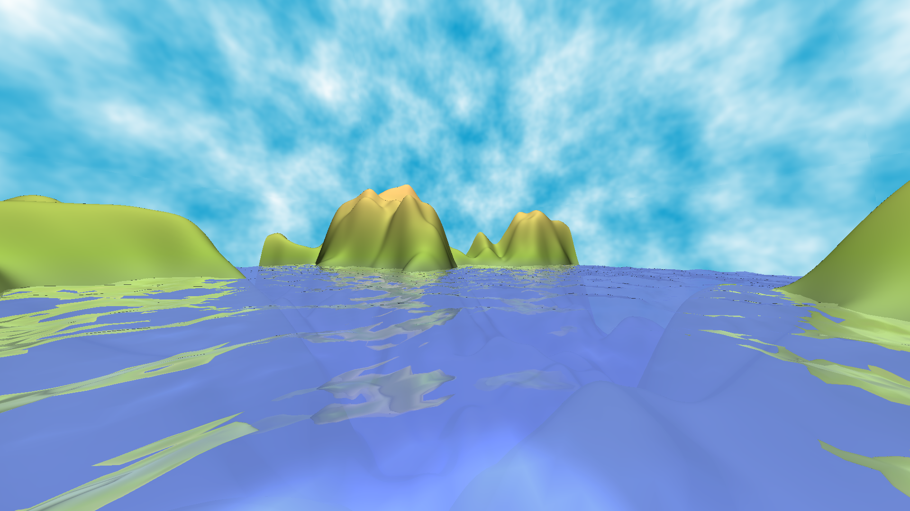
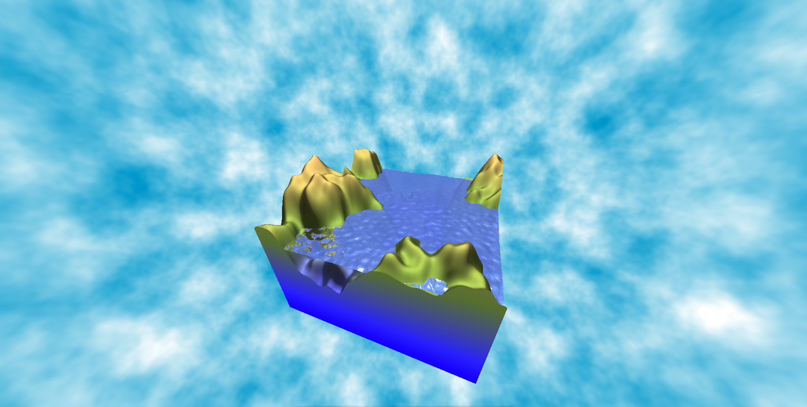

# Project report - Group 5

###### Markus Ding, Robin Mamie & Charline Montial

## What is our project about

## Technical approach

### Screen-space reflections

_Most of the work for this part was done in the files `src/render/MeshViewer.cpp`, `src/render/FrameBuffer.[(cpp)|h]` and `src/shader/reflection.frag`._

At first, we had to accommodate the code in order to communicate the colors of the terrain to the reflection shader.
For that, we created the class `FrameBuffer`, that contains all the informations necessary to generate simple screen-space reflections.
Namely, we forward the depth of the pixel and its color to the other shader, using frame buffers.
Even though we used screen buffers in assignment 7, using two of them as output of the same shader was not trivial, and we spent a lot of time looking for online resources talking about this.
After stringing bits and pieces of information, we finally managed to get a fully working implementation of this idea.
We also learnt the hard way that online OpenGL support is either scarce or very specialised...

Then, we wanted to adapt the code provided by one of the links displayed on the page reserved for the project ideas, namely [this blog post](https://gizmosandgames.com/2017/01/17/screen-space-reflections/).
Unfortunately for us, after a few days of trying, we did not manage to adapt the algorithm in our code, to our dismay.
No visible results were convincing and/or made sense.

Therefore, we decided to work out an even simpler algorithm, that uses a trivial ray marching technique.
Indeed, using the ray reflected from our viewing ray - according to the normal of the water -, we just iterate over very small portions of it until the resulting ray (i.e. viewing ray + `i` number of small reflection rays) "hit" the terrain, i.e. its depth is greater than the terrain.
The latter was sampled in a frame buffer, and can be directly used in the shader for this purpose.
The search is abandoned if the ray is outside of the screen or it "hits" the sky, meaning there will never be terrain after that.

There is a small exception to the screen rule.
To make the reflections look nicer, we still output a color when the ray exits the screen horizontally, mening they are not strictly speaking "screen-space" reflections.
But by clipping the result back to the border of the screen, it offers very beautiful results when the terrain is not perfectly flat, which is the case in this project.

{width="600px"}

{width="600px"}

{width="600px"}

Finally, we wanted to add the reflections of the sky.
Unfortunately, the clouds we use have a frequency too high for the reflections to look good, as showcased by the following examples:

### Dynamic water

### Sky and clouds

### Minor improvements

#### Sun shimmering on water

#### Sky reflection on water

#### Sides of the terrain closed

## Results

{width="600px"}

{width="600px"}

{width="600px"}

{width="600px"}

<video class='center' width="1000" controls>
  <source src="video/sample.mp4" type="video/mp4">
</video>
*Demonstration video staring all the implemented features*

## Contributions

#### Screenspace reflections
Robin Mamié

#### Dynamic water
Markus Ding, Robin Mamié & Charline Montial

#### Sky and clouds
Markus Ding & Charline Montial

#### Sky and clouds reflections
Robin Mamié

#### Sides of the terrain closed
Robin Mamié & Charline Montial

#### Separate land and water mesh
Charline Montial

#### Sun shimmering on the water
Robin Mamié

### Total
Robin Mamié: 38%
Markus Ding: 31%
Charline Montial: 31%

## References
