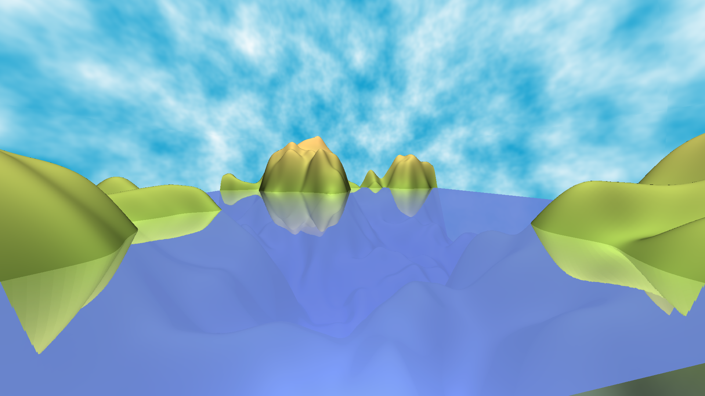
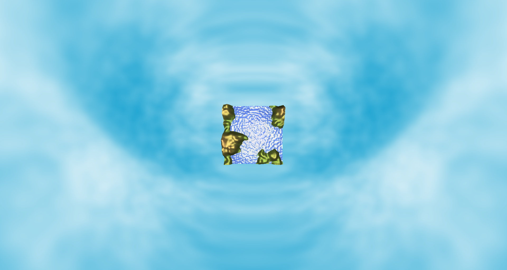
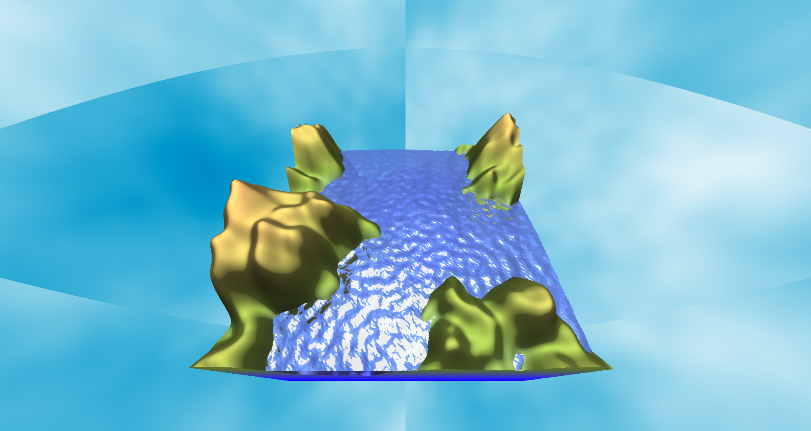
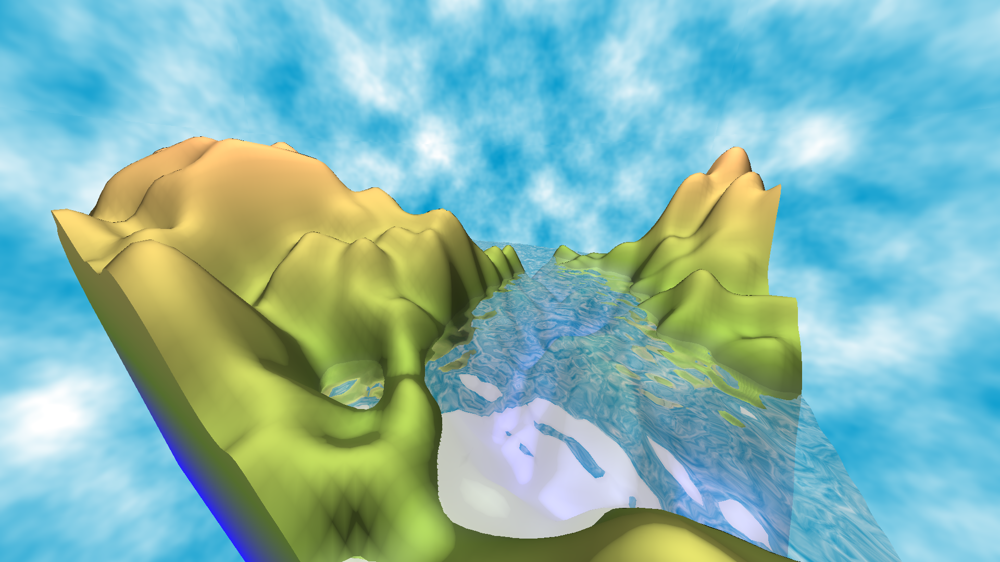
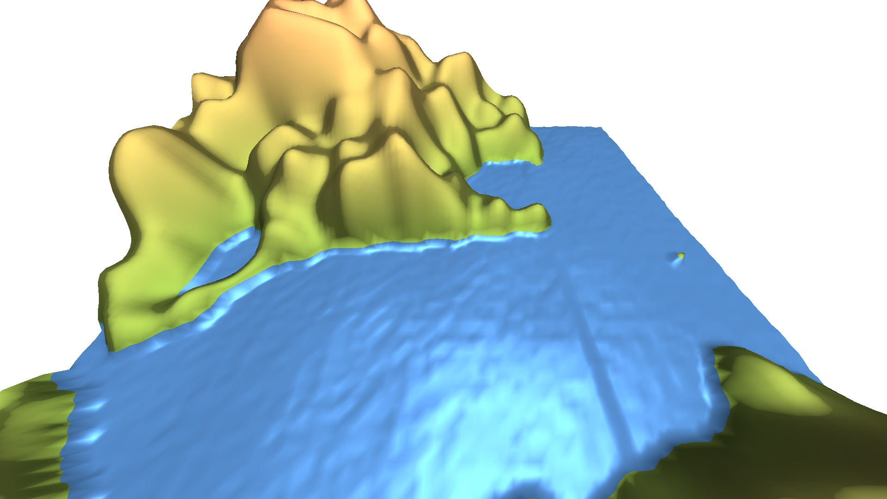
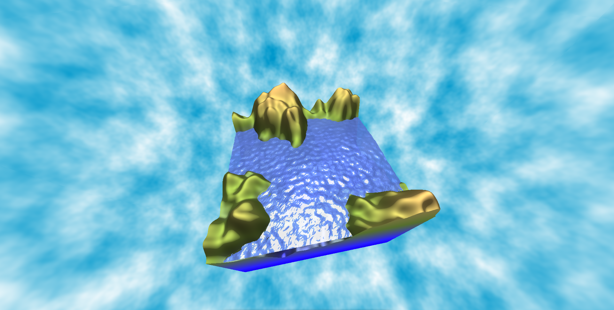
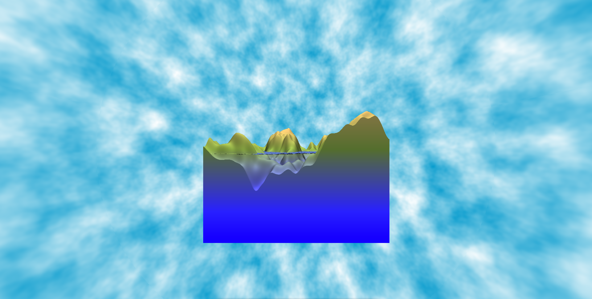

# Project Report - Group 5

###### Markus Ding, Robin Mamie & Charline Montial

## What is our Project About

The main goal to our project was to upgrade the already existing assignment 9 with various features, the main one being the screen-space reflections, followed by the waving water. The sky and clouds, with their reflection was our last objective.
We managed to complete all of our goals. In addition, a few improvements have been made here and there for nicer results.

## Technical Approach

The project is built and run using the usual way of this semester, by creating a build folder, and executing inside:

    cmake ..
    make -j
    ./terrain

### Screen-space Reflections

_Most of the work for this part was done in the files `src/render/MeshViewer.cpp`, `src/render/FrameBuffer.[(cpp)|h]` and `src/shader/reflection.frag`._

At first, we had to accommodate the code in order to communicate the colors of the terrain to the reflection shader.
For that, we created the class `FrameBuffer`, that contains all the informations necessary to generate simple screen-space reflections.
Namely, we forward the depth of the pixel and its color to the other shader, using frame buffers.
Even though we used screen buffers in assignment 7, using two of them as output of the same shader was not trivial, and we spent a lot of time looking for online resources talking about this.
After stringing bits and pieces of information, we finally managed to get a fully working implementation of this idea.
We also learnt the hard way that online OpenGL support is either scarce or very specialised...

Then, we wanted to adapt the code provided by one of the links displayed on the page reserved for the project ideas, namely [this blog post](https://gizmosandgames.com/2017/01/17/screen-space-reflections/).
Unfortunately for us, after a few days of trying, we did not manage to adapt the algorithm in our code, to our dismay.
No visible results were convincing and/or made sense.

Therefore, we decided to work out an even simpler algorithm, that uses a trivial ray marching technique.
Indeed, using the ray reflected from our viewing ray - according to the normal of the water -, we just iterate over very small portions of it until the resulting ray (i.e. viewing ray + `i` number of small reflection rays) "hit" the terrain, i.e. its depth is greater than the terrain.
The latter was sampled in a frame buffer, and can be directly used in the shader for this purpose.
The search is abandoned if the ray is outside of the screen or it "hits" the sky, meaning there will never be terrain after that.

There is a small exception to the screen rule.
To make the reflections look nicer, we still output a color when the ray exits the screen horizontally, meaning they are not strictly speaking "screen-space" reflections.
But by clipping the result back to the border of the screen, it offers very beautiful results when the terrain is not perfectly flat, which is the case in this project.

{width="600px"}

{width="600px"}

{width="600px"}

As a final touch, we also "dimmed" the reflections the further away they are, for a more realistic effect.
You can see this effect on the previous images: the reflections of the mountains in the background are bright on the base, and dimmed on the tips.

### Dynamic Water

The animation of the water is implemented  by changing the values of the points on the mesh, more precisely by making the z-coordinate change at each iteration.
We have gone over several different implementations before reaching the final one but all had in common that we generated an `Array2D` of the same size of the terrain corresponding to the z-coordinate values of the simulated water.

We also never recreate a mesh for each step of the animation but simply update the values of the current one for obvious performance reasons.

#### 2D Perlin and sinusoidal movement

At first, we kept a single mesh where both, the land mass and the water was on it. The water level surface was generated by subtracting some 2D perlin noise from the water level (`z-coordinate = WATER_LEVEL - perlin_noise(x,y)` instead of simply clamping it to `WATER_LEVEL` as done in assignment 9) in order to have the points of the mesh forming wave forms. This allowed us the have a static water surface.

Then, we added the movement by adding a sinusoidal function (with a parameter containing its x and y coordinates as well as the elapsed time) to the z-value of all water points on our mesh at each iteration.

This gave us some bigger waves with a nice water surface but it didn't really satisfy us.

<video class='center' width="1000" controls>
  <source src="video/sinusoidal_water.mp4" type="video/mp4">
</video>


#### Shifted 2D Perlin function

We decided to abandon the idea of the sinusoidal waves on top of our generated water surface and we decided to simply keep the current smaller waves created by the perlin noise and simply shifted the points along the x-axis in order to have the wave "move over the water". We considered our world to be a torus which allowed us the loop infinitely without having to render extra water surface.

So in short, at each `dt` step of the animation we did the following:

```C++
time += dt;

for(int x = 0; x < TERRAIN_SIZE; ++x){
    for(int y = 0; y < TERRAIN_SIZE; ++y){
        int index = x*TERRAIN_SIZE + y;
        if (vertices_[index].position.z < WATER_LEVEL) // is water
            vertices_[index].position.z = water_values[(x+time)%TERRAIN_SIZE][y];
    }
}
```

But this created the problem that if our two opposite borders (the one at `x=0` and the other at `x=TERRAIN_SIZE-1`) were not the exact same height (z-coordinate), there will be a bump (or a mini-tsunami) when we loop around the indices and we jump from one to the other as can be seen on the image below:


{width="600px"}

#### Improved 3D Perlin version

In the end, we opted for a real 3D perlin noise which allowed us the simply use all 3 coordinates as follows: `perlin3d(x, y, time)` and so we didn't have to fake the movement of the water by adding a sin-function or shifting the points along an axis.

We do not compute the new waves in real-time but we generate a certain number of steps at the launch of the program in the shader and store them in our water mesh as an attribute. Then on each step of the simulation, we simply have to iterate over them by updating the z-coordinate values of all `(x,y)` pairs of water points.

The code for the different parts can be found in:

- `shaders/noise.frag` for the perlin3D function

- `main_terrain.cpp` and `shaders/display_water.frag` for the water generation

- The `void Mesh::move(double dt)` to add the movement

- A few additional minor changes to link it all together in various other files

##### Additional points about the Perlin 3D noise

We [adapted the code](./pdf/perlin3d_assignment9.pdf) of the original assignment 9 (so not included in this project) in order to be able to visualize the Perlin 3D noise by running the `run_fb.sh` script: by clicking on the keys `E` and `R`, we can change the value of the z-coordinate of the Perlin function and thus see different 2D layers being generated.

We did this as a proof of concept before using the Perlin 3D noise to our wave generation. Below you can see a few of these *layers* and thus how the noise evolves according to the z-coordinate:

<p float="left">
  
  
  
  
  
  
  
</p>


### Sky and Clouds

_Most of the work for this part was done in the files `src/sky/sphere.[(cpp)|h]`, `src/sky/sky.h`,`src/render/MeshViewer.[(cpp)|h]`, `src/shader/sky.[(frag)|(vert)]` and `src/shader/noise.frag`._

For the main strategy, we wanted to render a sphere as a support for our background in a similar way as the stars in the solar system assignment. Then, our idea was to use a noise function and interpolate the blue and white colors according to the noise value to generate our cloudy sky. The last step is then to map the generated values on the sphere.

To implement this, we first imported and adapted the classes `sphere` and `planet` (which is now called `sky`) from assignment 6 which was about the solar system.
Then we added an attribute of type `Sky` to `Meshviewer` as well as a sky shader.

We first tried to use Perlin 2D noise, but the mapping on the sphere was terrible because the texture was deformed on the sides which led to unrealistic results and we could see that the support of our sky was a sphere, which was undesirable.



When we switched to 3D Perlin noise, the problem was solved after shifting the parameters as the `position` in the shaders is normalized and that resulted in our spheres being "cut" into quarters (where one of the coordinates crosses 0):



So we tweaked the values a bit and finally, we were very pleased with the visual aspect of the clouds with the following values: `perlin_fbm_3d(5*position+500)`.

### Minor Improvements

#### Sun Shimmering on the Water

We wanted to amplify the effect of the phong lighting model in order to have a bigger effect of the sun shimmering on the water.
This was simply done by, instead of the "normal" colour of the sky, outputting plain white when the dot product between the reflected ray and the light source is greater than 0.8.
This value was empirically computed, and gave us the most convincing results.

#### Sky Reflection on the Water

As specified in our contract, we wanted to add the reflections of the sky.
We have done it, but we decided to not include it in the final presentation.
Unfortunately, the clouds we use have a frequency too high for the reflections to look good, as showcased by the following examples:

{width="600px"}

{width="600px"}

The sky reflections are even weirder when the water is moving, and the whole landscape just looks like a giant ugly vortex.
As proof for our work, we have included the shader under the name `src/shader/cursed_reflection.frag`.

#### Separation of water and land meshes

_Most of the work for this part was done in the files `src/render/MeshViewer.[(cpp)|h]` and `src/main_terrain.cpp`._

We wanted to separate the land and water meshes in our project for two reasons.

First, the transition between the land and the water was weird as it can be seen in the screenshot below and it certainly did not improve when the water began to wave.

Secondly, we wanted to achieve this because it would allow us to have a transparent water. We thought that it would be more realistic to see the bottom of our land and for that, we needed to separate the two meshes, which is what we did.

{width="600px"}

To achieve this, we added two attributes to the `MeshViewer` class for the water, namely a shared pointer to an instance of the class `Mesh` and another one to an instance of the class `StaticMeshActor`. Then, the water mesh is also generated in the file `main_terrain.cpp` in the same way as the land mesh, but using its own function to generate the wanted values for the water. The newly created water mesh is simply superposed it to the land mesh.

#### Sides of the terrain closed

_Most of the work for this part was done in the files `src/render/MeshViewer.[(cpp)|h]` and `src/main_terrain.cpp`._

We wanted to close the sides of the terrain because we could see the water under the mountain and it was not very pleasant.

To achieve this goal, we added another mesh similarly to the water and passed the correct values to it.

Since we only need the sides for our mesh, we were allowed to have an array of vertices of a size much smaller than the one needed to generate the land and the water.

To fill in the array, we fix one coordinate and iterate on the other to fill one wall. We repeat the procedure four time for each wall and push the newly constructed faces.
We alternate between vertices having the z coordinate at the height of the terrain and another one being at the base of our wall. We can then construct our faces using the vertices which follow the terrain and the ones being aligned at the bottom of the terrain.

The ground has also been implemented and was simpler since it did not need the height map.

For a more good-looking result, Phong lighting has been disabled for the sides.

#### Miscellaneous

The user can dump all frames in files named `frame_<frame nb>.png` by pressing `C` during the execution of the program.

The arrows allow the user to change the view as in assignment 9, while WASD allow them to have a smoother experience while exploring the landscape.

## Results

{width="600px"}

{width="600px"}

{width="600px"}

{width="600px"}

<video class='center' width="1000" controls>
  <source src="video/sample.mp4" type="video/mp4">
</video>
*Demonstration video starring all the implemented features*

## Contributions

#### Screen-space Reflections
Robin Mamié

#### Dynamic Water
Markus Ding, Robin Mamié & Charline Montial

#### Sky and Clouds
Markus Ding & Charline Montial

#### Sky and Clouds Reflections
Robin Mamié

#### Sides of the Terrain Closed
Robin Mamié & Charline Montial

#### Separate Land and Water Mesh
Charline Montial

#### Sun Shimmering on the Water
Robin Mamié

### Total
Robin Mamié: 38%
Markus Ding: 31%
Charline Montial: 31%

## Source Files

## References

- Library used : OpenGL
- 3D-perlin noise: <https://mrl.nyu.edu/~perlin/noise/>
